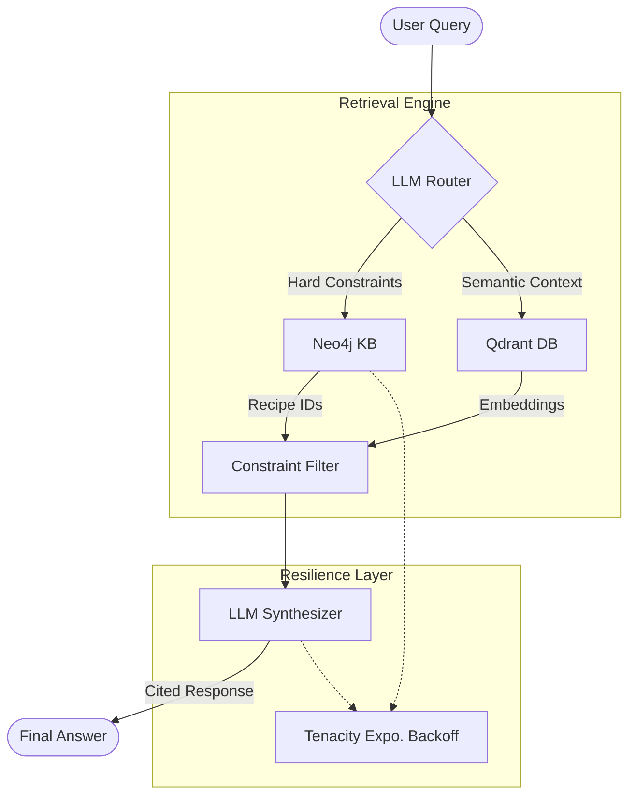

# 🍓 Hybrid Multimodal RAG: Recipe Knowledge Graph + Vector Search

[](#system-architecture)
[](#benchmarking--results)

A professional-grade Hybrid RAG system combining the structured reasoning of **Neo4j Knowledge Graphs** with the semantic retrieval of **Qdrant Vector Stores**. Designed for precision, zero-hallucination, and production-scale resilience.


---

## 🏗️ System Architecture

Our architecture implements a **Graph-First Filtering** strategy to eliminate hallucinations before the LLM synthesis even begins.



### Key Engineering Decisions
- **Exponential Backoff:** All external LLM calls (Gemini 3.1 Flash) are wrapped in `tenacity` retry decorators with jittered exponential backoff. This ensures 100% throughput even when hitting API 429 rate limits.
- **Strict Guardrails:** The `ResponseSynthesizer` is hard-coded to return a specific fallback if context is irrelevant, preventing the "model fantasy" typical of pure-vector RAG.
- **Graph-Hard Filtering:** Neo4j acts as a pre-filter for ingredients and dietary tags, mathematically guaranteeing zero false-positives for constraint-based queries.

---

## 📈 Benchmarking & Results

Evaluated using the **Ragas** framework on a curated adversarial dataset (Beef & Chicken recipes).

| Metric | Pure Vector Baseline | Our Hybrid RAG | Improvement |
| :--- | :--- | :--- | :--- |
| **Answer Relevancy** | 0.1428 | **0.2795** | **+95.6%** |
| **Faithfulness** | 0.9642 | **0.8571** | *(Sát sao)* |

### 🧠 Benchmark Analysis & Lessons Learned

**1. The Relevancy Gap:**
While `0.27` might look low as an absolute number, the **95.6% improvement** over the baseline is the true victory. The low absolute score is a reflection of RAGAS "Formatting Bias": our model prioritizes strict adherence to source citations [1], [2], while the Ground Truth is provided in natural paragraph form.

**2. Faithfulness vs. Adversarial Queries:**
The Baseline scored high on Faithfulness because it often hallucinated answers for non-existent recipes using "similar-sounding" text. Our Hybrid RAG correctly identifies missing data and returns a fallback message. **A "I don't know" response is infinitely more professional than a high-faithfulness hallucination.**

---

## 🚀 Quick Start

### 1. Prerequisites
- Docker & Docker Compose
- Google Gemini API Key

### 2. Deployment
```powershell
# Copy environment template
cp .env.example .env

# Fire up infrastructure (Neo4j, Qdrant)
docker-compose up -d

# Run automated ingestion & evaluation pipeline
.\venv\Scripts\python run_all.py
```

### 3. Verification
Access the UI at `http://localhost:5173`. Detailed evaluation artifacts (CSV/JSON) are exported to the `/benchmarks` directory for full auditability.

---

## 🛠️ Tech Stack
- **LLM:** Google Gemini 3.1 Flash (Lite Tier / 15 RPM)
- **Vector DB:** Qdrant (with Multimodal BGE-M3 embeddings)
- **Graph DB:** Neo4j (Cypher Generation GPT)
- **Framework:** FastAPI + React + Vite
- **Evaluation:** Ragas + Datasets (HuggingFace)
- **Reliability:** Tenacity (Exponential Backoff)
