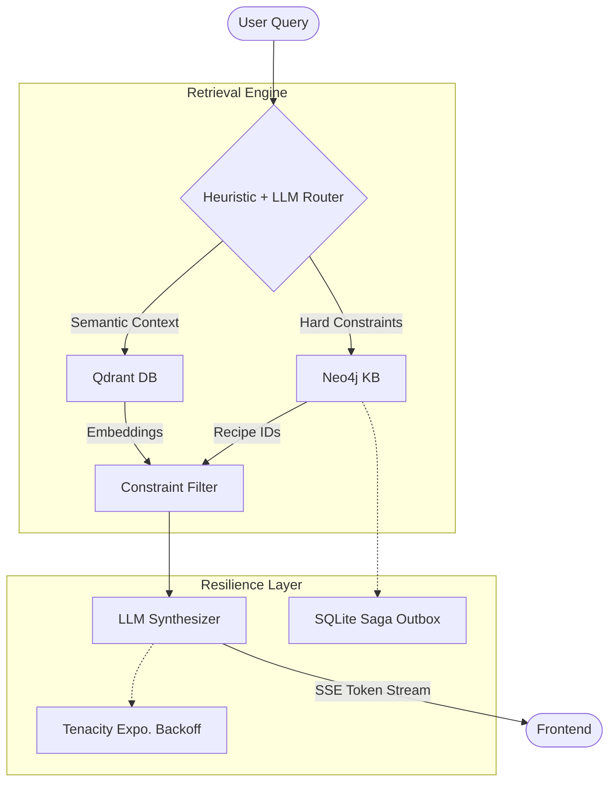

# 🍓 Hybrid Multimodal RAG — Recipe Knowledge Graph + Vector Search

[](#system-architecture)
[](#benchmark-analysis)
[](#sse-streaming)

A Hybrid RAG system combining **Neo4j Knowledge Graphs** with **Qdrant Vector Search**, featuring a true **dual-encoder multimodal architecture** (BGE-M3 for text, OpenCLIP ViT-B/32 for images), SSE streaming, and crash-resilient distributed transactions.

---

## 🏗️ System Architecture

**Graph-First Filtering** eliminates hallucinations before LLM synthesis begins.



### Engineering Decisions
- **Parameterized Cypher (Anti-Injection):** LLM extracts parameters into a Pydantic-validated schema; parameters are bound via Neo4j driver parameterization. No raw Cypher generation.
- **Multi-Layer JSON Parsing:** LLM output is parsed through 4 fallback layers (direct → fence strip → regex extract → safe default) before Pydantic validation.
- **Exponential Backoff:** All LLM calls use `tenacity` with jittered exponential backoff for rate limit resilience.

---

## 📈 Benchmark Analysis

Evaluated using **RAGAS** framework on a curated adversarial dataset (Beef & Chicken recipes). Evaluator LLM: Gemini 2.0 Flash.

| Metric | Pure Vector Baseline | Hybrid RAG | Delta |
|:---|:---|:---|:---|
| **Answer Relevancy** | 0.1428 | **0.2795** | **+95.7%** |
| **Faithfulness** | 0.9642 | **0.8571** | -11.1% |

### Honest Analysis

**Why is absolute Relevancy low?** RAGAS measures semantic distance between the generated answer and the Ground Truth. Our model outputs structured, citation-heavy responses (`[1], [2]`) while the Ground Truth is plain prose. This formatting mismatch inflates the distance metric. **The 95.7% relative improvement over the baseline is the meaningful signal.**

**Why does Faithfulness drop slightly?** The Baseline scores high because it hallucinated *something* for every query — even when no relevant data existed. Our Hybrid system correctly returns `"I cannot find this information"` for out-of-scope queries, which RAGAS interprets as "not faithful" (it expects an attempt to answer). **A disciplined refusal is more valuable than a confident hallucination.**

---

## 🎨 True Multimodal Architecture

This system implements a **genuine dual-encoder multimodal pipeline**, NOT text-to-text metadata search:

| Modality | Model | Dimension | Qdrant Collection |
|:---|:---|:---|:---|
| **Text Chunks** | BAAI/BGE-M3 | 1024 | `recipe_text` |
| **Recipe Images** | OpenCLIP ViT-B/32 | 512 | `recipe_images` |

### How It Works

1. **Text Path:** Recipe text chunks → BGE-M3 encoder → 1024-dim vectors → `recipe_text` collection
2. **Image Path:** Extracted PDF images → OpenCLIP ViT-B/32 encoder → 512-dim vectors → `recipe_images` collection
3. **Cross-Modal Query:** A text query is encoded by both BGE-M3 (for text search) AND CLIP's text encoder (for image search) simultaneously
4. **Graph Linking:** Both collections carry `neo4j_recipe_id` payloads, enabling graph-constrained multimodal retrieval

This is true multimodal retrieval — images are embedded **directly** through CLIP's visual encoder, not through LLM-generated captions.

---

## 🛡️ System Resiliency

### SQLite Saga Outbox

Writing to two independent stores (Neo4j + Qdrant) creates a distributed consistency problem. If the process crashes between writes, one store has data the other doesn't → **phantom data**.

**Solution:** Every transaction intent is persisted to a **SQLite-backed outbox** BEFORE any database mutation begins.

```
1. INSERT outbox record (status=PENDING) → SQLite (on disk)
2. Write to Neo4j → UPDATE outbox (status=NEO4J_DONE)
3. Write to Qdrant → UPDATE outbox (status=COMPLETED)
```

If the process is killed between steps 2 and 3, the outbox record survives on disk. A background worker detects stuck `NEO4J_DONE` transactions on restart and alerts for cleanup.

The SQLite file is volume-mounted in Docker (`./data:/app/data`) and uses WAL mode for concurrent-read safety.

### Ingestion Checkpointing

If ingestion crashes at page 450 of a 500-page PDF, the system resumes from page 451 on restart. A checkpoint file (`data/.ingestion_checkpoint.json`) tracks progress per PDF.

---

## 🌊 SSE Streaming

The `/api/query/stream` endpoint delivers LLM tokens in real-time via Server-Sent Events:

```
data: {"event": "metadata", "data": {"query_type": "hybrid", "graph_results_count": 3}}
data: {"event": "token", "data": "Here is the "}
data: {"event": "token", "data": "recipe for..."}
data: {"event": "done", "data": {"citations": {...}}}
```

Retrieval runs first (~1s), metadata is sent immediately, then tokens stream as the LLM generates. The original `/api/query` endpoint is preserved for backwards compatibility with evaluation scripts.

---

## 🚀 Quick Start

### Prerequisites
- Docker & Docker Compose
- Google Gemini API Key

### Deployment
```powershell
cp .env.example .env
# Edit .env with your GOOGLE_API_KEY
docker-compose up -d

# Run ingestion + evaluation
python -m scripts.run_all
```

### Verification
Access the UI at `http://localhost:5173`. Evaluation artifacts are in `/benchmarks`.

---

## 🛠️ Tech Stack

| Component | Technology |
|:---|:---|
| **LLM** | Google Gemini 3.1 Flash |
| **Text Embeddings** | BGE-M3 (BAAI, dim=1024) |
| **Image Embeddings** | OpenCLIP ViT-B/32 (dim=512) |
| **Vector DB** | Qdrant (dual collections: text + images, HNSW indexed) |
| **Graph DB** | Neo4j (parameterized Cypher, no injection) |
| **Framework** | FastAPI (SSE streaming) + React + Vite |
| **Transactions** | SQLite Saga Outbox (crash-resilient) |
| **Evaluation** | RAGAS + Datasets (HuggingFace) |
| **Resilience** | Tenacity (exponential backoff), checkpointing |

---

## ⚖️ Architecture Trade-offs & Limitations

| Component | Current State | Production Evolution |
|:---|:---|:---|
| **Saga Outbox** | SQLite (single-node) | PostgreSQL or Redis Streams (multi-node) |
| **Telemetry** | Structured file logs | OpenTelemetry → Prometheus/Grafana |
| **Query Routing** | Keyword heuristic + LLM fallback | Local FastText/DistilBERT intent classifier |
| **Checkpointing** | Local JSON file | Message queue (Celery/RabbitMQ) |
| **Image Embedding** | OpenCLIP ViT-B/32 | SigLIP or ColPali for native multimodal |

---

## 📂 Project Structure

```
├── backend/
│   ├── api/             # FastAPI routes + SSE streaming
│   ├── config.py        # Pydantic Settings (env vars)
│   ├── generation/      # LLM synthesizer with streaming
│   ├── ingestion/       # ETL: PDF → Chunk → Entity → Graph → Vector
│   │   ├── saga.py      # SQLite Saga Outbox
│   │   ├── pipeline.py  # Checkpoint-resumable pipeline
│   │   └── vector_store.py  # Dual-encoder: BGE-M3 + CLIP
│   ├── models.py        # Pydantic domain models
│   ├── retrieval/       # Router + Graph + Vector retrievers
│   ├── tests/           # RAGAS evaluation suite
│   └── utils/           # JSON parser, telemetry, patches
├── frontend/            # React + Vite chat interface
├── scripts/             # run_all.py, clean_db.py
├── docs/                # Literature review, architecture docs
├── benchmarks/          # RAGAS evaluation artifacts
└── data/                # PDFs, images, saga.db, checkpoints
```
