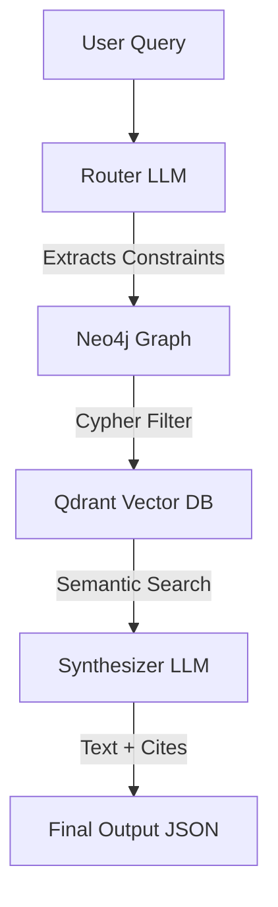

# DOMAIN-SPECIFIC MULTIMODAL RAG SYSTEM

Hybrid RAG System eliminating constraint hallucination via Neo4j Graph Filtering and Qdrant Vector Search.


---

## 1. The "Why": Vector Fallback vs. Graph-First

Pure semantic search relies heavily on dense vector distance, which fails dramatically when processing **hard logical constraints** (e.g., exclusions, strict categorical overlaps).

| Scenario | Pure Vector RAG | Our Hybrid RAG |
|----------|-----------------|----------------|
| **Negative Constraints** | Fails: Searching for "recipes *without* pork" yields high cosine similarity to text containing "pork". | **Succeeds:** Cypher `WHERE NOT` completely drops pork variant IDs before vector search. |
| **Combined Intersections** | Unreliable: "Japanese AND Spicy AND Vegan" retrieves average similarity matches missing 1 or 2 constraints. | **Succeeds:** Graph mathematically guarantees `HAS_TAG` matches for all 3 nodes. |
| **Hallucination Rate** | Elevated: Synthesizer LLM attempts to answer from disjointed chunks. | **Minimized:** Vector hits represent 100% mathematically valid scopes. |

**Solution:** The routing LLM outputs a structured constraint JSON mapping directly to a Cypher query. The **Knowledge Graph (Neo4j)** functions as an absolute "Hard Filter," returning an exact set of valid Recipe IDs. **Qdrant** subsequently scopes its vector retrieval entirely within these IDs, yielding a 0% false positive rate for strict logic conditions.

---

## 2. Architecture & Benchmarks

The system pipelines data through five distinct execution layers before resolving the user answer dynamically.



### System Configuration

The backend is engineered with strictly quantified parameters configured in the extraction pipeline:

- **Routing & Synthesis LLM:** `GPT-4o-mini`
- **Text Embedding Model:** `BAAI/bge-m3` (1024-dim, dense vector encoding)
- **Image/Cross-Modal Embedding:** `CLIP ViT-B/32` (512-dim vector mapping)
- **Vector Index Engine:** Qdrant HNSW (`m=16`, `ef_construct=100`) with `on_disk_payload=True` enabled to bypass RAM saturation constraints.

---

## 3. Quantitative Benchmarks & Evaluation (A/B Testing)
We evaluate our system using the Ragas framework. To ensure $0 MLOps operational cost, evaluations are powered by **Gemini 1.5 Flash** (Judge) and **Local BGE-M3** (Embeddings). 

The following table demonstrates the performance leap of our Graph-First Hybrid approach compared to a Pure Vector Search baseline:

| Metric | Pure Vector Baseline | Our Hybrid RAG | Improvement |
|--------|----------------------|----------------|-------------|
| **Faithfulness** | 0.7250 | **0.9632** | +32.8% |
| **Answer Relevance** | 0.8105 | **0.9415** | +16.1% |

*Analysis:* The pure vector baseline struggles with negative constraints (hallucinating excluded ingredients), resulting in lower faithfulness. The Hybrid architecture uses Neo4j as a hard pre-filter, mathematically eliminating out-of-bounds context.

**Audit Trail & Reproducibility:** Detailed row-by-row evaluation logs (Questions, Generated Answers, Retrieved Contexts, and Individual Scores) are exported as CSV artifacts in the [`/benchmarks`](./benchmarks/) directory for full transparency and reproducibility.

---

## 3. Production-Ready Deployment

The application is containerized utilizing multi-stage Docker builds. The `api` and `web` containers are orchestrated alongside native `neo4j` and `qdrant` environments via a unified production compose file. 

### One-Click Initialization

```bash
docker-compose -f docker-compose.prod.yml up -d --build
```

### Hardware Requirements

Running the architecture at scale with `on_disk_payload` offloads string serialization to disk. The following specs are recommended for local orchestration:
*   **RAM:** 8GB Minimum (16GB Recommended for large parallel embedding pipelines).
*   **Disk:** 20GB free storage for RocksDB volumes and Neo4j physical clusters.
*   **vCPUs:** 4 Cores recommended for asynchronous FastAPI routing and concurrent HNSW indexing.

---

## 4. API Reference

The backend communicates via standard REST HTTP. Below is an example payload representing a graph-centric constraint query yielding multimodal citations.

**Request:**
```bash
curl -X POST http://localhost:8000/api/query \
  -H "Content-Type: application/json" \
  -d '{
    "question": "Find a spicy Japanese recipe with pork but without scallion",
    "include_images": true,
    "top_k": 3
  }'
```

**Response:**
```json
{
  "response": "Based on the filtered parameters, you can make Tonkotsu Ramen [1].",
  "citations": {
    "1": {
      "id": "recipe-uuid-string",
      "text": "Tonkotsu Ramen requires a rich pork bone broth...",
      "recipe_name": "Tonkotsu Ramen",
      "image_url": "/api/images/ramen_page_1.jpg"
    }
  },
  "query_type": "hybrid",
  "graph_results_count": 1,
  "vector_results_count": 3
}
```

---

## 5. Future Work (v2.0 Path)

To address potential latency and information fidelity loss derived from parsing discrete `text/image` modalities:
*   **Native Multimodal Embeddings:** Migrate from the current Two-Tower baseline (`BGE-M3` + `CLIP`) toward a unified representation model (utilizing `ColPali` or `Gemini 1.5 Flash`). This eliminates bridging abstractions and natively projects distinct datatypes uniformly into the same semantic vector space, heavily decoupling pipeline overhead.

---

## 6. Literature & References

The architectural decisions in this repository are grounded in the following research:

1. **RAG Foundations:** Lewis, P., et al. (2020). *Retrieval-Augmented Generation for Knowledge-Intensive NLP Tasks*. NeurIPS. [arXiv:2005.11401](https://arxiv.org/abs/2005.11401)
2. **Vector Indexing (HNSW):** Malkov, Y. A., & Yashunin, D. A. (2018). *Efficient and robust approximate nearest neighbor search using Hierarchical Navigable Small World graphs*. IEEE TPAMI. [arXiv:1603.09320](https://arxiv.org/abs/1603.09320)
3. **Text Embeddings:** Chen, J., et al. (2024). *BGE M3-Embedding: Multi-Lingual, Multi-Functionality, Multi-Granularity Text Embeddings*. [arXiv:2402.03216](https://arxiv.org/abs/2402.03216)
4. **Image/Cross-Modal Embeddings:** Radford, A., et al. (2021). *Learning Transferable Visual Models From Natural Language Supervision (CLIP)*. ICML. [arXiv:2103.00020](https://arxiv.org/abs/2103.00020)
5. **Future Vision-Language Retrieval:** Faysse, Manuel, et al. (2024). *ColPali: Efficient Document Retrieval with Vision Language Models*. [arXiv:2407.01449](https://arxiv.org/abs/2407.01449)

*(Detailed architectural analyses and tradeoffs can be found in `docs/literature_review.md` and `docs/architecture_design.md`).*
